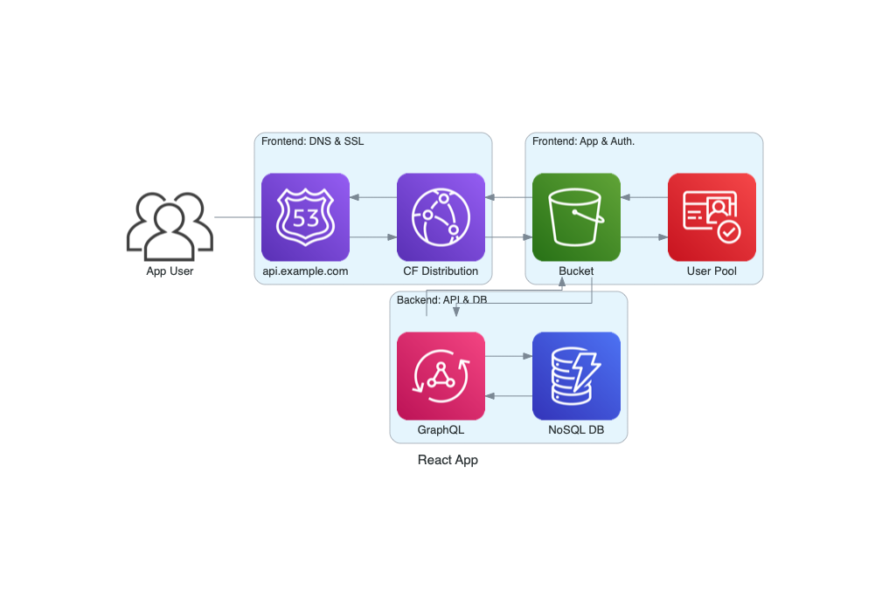
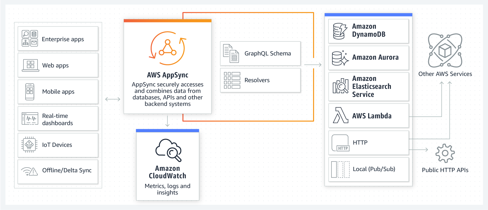

<!-- pandoc  presentation.md --reference-doc custom-reference.pptx -o powerpoint.pptx -->

---

## Agenda

* What's new on AWS?
* Usecase: Collecting Notes App
* Architectural Design
* Implementation via the Cloud Development Kit (CDK)
* Implementation via the Amplify CLI
* Open Space

---

## Whats new on AWS

### My personal highlights from 240 features launched since 01-01-2020

* AWS Step Functions now supports CloudWatch Logs for standard workflows
* AWS Lambda participates in Compute Savings Plans
* Announcing Microsoft Azure Active Directory support for Amazon Redshift
* AWS CloudFormation StackSets introduces automatic deployments across accounts and regions through AWS Organizations
* Amazon Cognito User Pools service now supports case insensitivity for user aliases
* Configure fine-grained data access with Amazon Elasticsearch Service
* Amazon Elastic Container Service has added support for canary deployments
* Amazon Redshift now supports per-second billing
* AWS Compute Optimizer Available In 11 Additional Regions
* Amazon RDS for MySQL Supports Authentication with Microsoft Active Directory

---

## Usecase: Collecting Notes App I

* Why: Comittment of all parents to work free charge for son's kindergarten.
* Who: 75 kids with round about 2 parents
* Why:
  * The comittment forces parents to spend four hours per month for the kindergarten.
  * Every missed hour comes up with 20 €
  * 75 (Families) x 4 (hours) x 12 (months) x 20 (€) = 72.000 in total

---

## Usecase: Collecting Notes App II

:::::::::::::: {.columns}
::: {.column width="50%"}

* User Management
* Autom. Reporting
* User Seperation
* Maybe: IDP, like Google

:::
::: {.column width="50%"}

* GDPR compliant
* Fast Solution
* Simple Management
* Maybe: Multi platform support

:::
::::::::::::::

---

## Architectural Design



---

## Architectural Design - Frontend

* DNS: some nice URL - Route53
* SSL: https everywhere - CloudFront
* ReactApp: For fun and simplicity - S3 with a dedicated Bucket
* Authentication: Using an Userpool - Cognito

::: notes

* Route53: DNS Service, Registrat, Routing Policies, Private and Public Hosted Zones
* CloudFront: Content Delivery Network, DDoS protection, CNAME capability, S3 Protection
* S3: Object storage, server capability without server-side language support
* Cognito: User- and indentity pool, supports SAML, OpenID and JWT

:::

---

## Architectural Design - Frontend - Cognito


---

## Architectural Design - Backend

* API: GraphQL for Fun and Simplicity (no Lambda Developing) - AppSync
* Serverless DB: No Network or Security Discussions - DynamoDB

::: notes

* AppSync: flexible API design for real-time apps with GrapQL
* DynamoDB: NoSQL DB, no limit towards size, API based calls

:::

---

## Architectural Design - Backend - Appsync



---

## Implementation via the Cloud Development Kit (CDK)

* 375 lines of code ...

---

## Implementation via the Amplify CLI I

* Let's us the Amplify CLI instead!
  
```bash
npm install -g @aws-amplify/cli

amplify configure # You need a functional user
```

:::notes

https://dev.to/aws/10-minute-tutorial-creating-a-serverless-express-web-server-api-29j7
https://github.com/dabit3/awesome-aws-amplify

:::

---

## Implementation via the Amplify CLI II

* Let's us the Amplify CLI instead!
  
```bash
npx create-react-app amplify-version

cd amplify-version

npm install aws-amplify

amplify init
```

---

## Implementation via the Amplify CLI III

* Lets' add the Database
* Let's add the API
* Let's add the Authentication
* Let's build the App itself

---

## Implementation via the Amplify CLI IV


:::notes

Amplify is not able to deal with Rout53 and CNAMEs of CF distributions.

:::

---

## Open Space

Thanks for listening!

---
