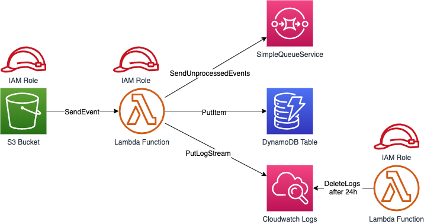

# Architecture

* S3 Bucket, Lambda and a DynamoDB table
* Cloudwatchs Logs will be deleted by a second Lambda after one day
* Plot:
  * Upload a CSV to S3
  * Read the contens from teh CSV to Lambdapipe
  * Put the content row by row into DynamoDB

