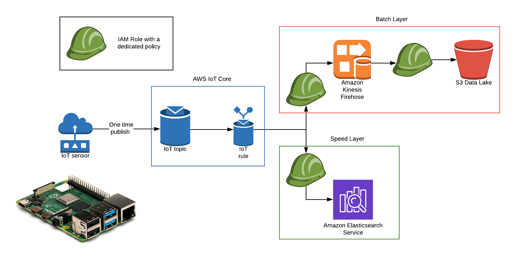

# IoT Data Streaming on AWS

**Disclaimer**: You are fully responsible for your account activities! This includes costs as well!

## Architecture der Demo

The CDK app will build this architecture



## 4 CDK Stacks in one App

* The App consist of three stacks:
  * S3
  * Kinesis Firehose
  * ElasticSearch
  * IoT Ressourcen

```python
# in app.py
...
bucket = S3Stack(app,s "s3", description=S3_DESCRIPTION)
stream = KinesisStack(app, "firehose", bucket_arn=bucket._bucket_arn, description=FIREHOSE_DESCRIPTION)
es_domain = ElasticSearchStack(app, "es-cluster", description=ElasticSearch_DESCRIPTION)
iot = IoTStack(app, 
    "iot", 
    delivery_stream_arn=stream._delivery_stream_arn, 
    delivery_stream_name=stream._delivery_stream_name, 
    es_domain_arn=es_domain._es_domain_arn,
    es_domain_name=es_domain._es_endpoint, 
    description=IOT_DESCRIPTION
)
...
```

* Unfortunenatly, you need to provision the IoT certificates in a additional step:

```bash
aws iot create-keys-and-certificate \
--set-as-active \
--certificate-pem-outfile "certs/demo.pem.crt" \
--public-key-outfile "certs/demo.public.key" \
--private-key-outfile "certs/demo.private.key"
```

* Run the app with `cdk deploy s3 kinesis es-cluster iot`

## IoT Device

* You need to push your certificateson your IoT device
* This is my demo:


## IoT Device Script

The script from the Pi can be found [here](CDK/streaming/Pi/demo.py)!

