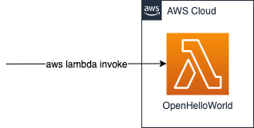
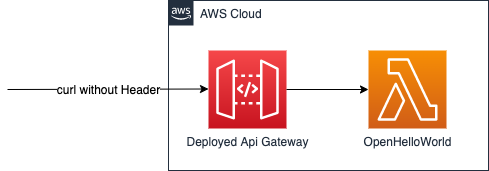
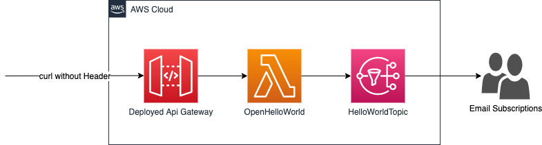
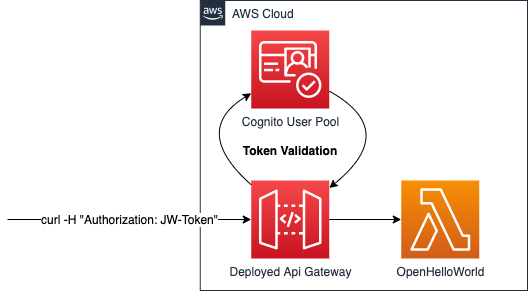

# SAM Hello World

The repo conatins a series of `SAM` examples.

## Simple Javascript Lambda

## Simple Javascript Lambda with Api Gateway in Front

## Simple Javascript Lambda with Api Gateway in Front and Simple Notification Integration

## Api Gateway with a Cognito Integration

## Source

This is an adoption code repository of the following article:

> [Creating AWS Lambda Applications With SAM](https://medium.com/@weibeld/creating-aws-lambda-applications-with-sam-dd13258c16dd)
